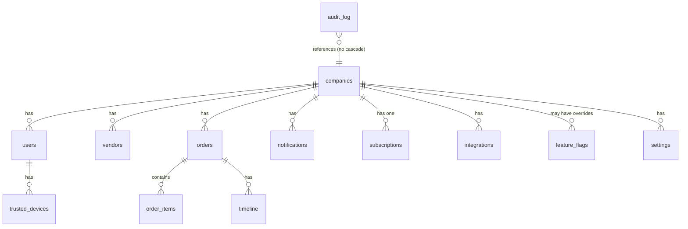

# Flowxiq — Database Schema

## ER Diagram

## Tables

---

### `companies` — Business Workspaces

| Column | Type | Constraints | Description |
|---|---|---|---|
| id | TEXT | PK | UUID |
| name | TEXT | NOT NULL | Business name |
| logo_url | TEXT | nullable | Logo image URL |
| currency | TEXT | NOT NULL, default 'USD' | 3-letter ISO currency |
| commission_rate | REAL | NOT NULL, default 0 | Worker commission % |
| status | TEXT | NOT NULL, default 'active' | `active` \| `suspended` \| `cancelled` |
| industry | TEXT | nullable | Business industry |
| business_type | TEXT | nullable | Type of business |
| country | TEXT | nullable | Country |
| state_province | TEXT | nullable | State/Province |
| city | TEXT | nullable | City |
| timezone | TEXT | nullable | IANA timezone string |
| language | TEXT | nullable | ISO language code |
| website | TEXT | nullable | Business website |
| phone | TEXT | nullable | Business phone |
| email | TEXT | nullable | Business email |
| tax_id | TEXT | nullable | Tax ID / EIN |
| plan | TEXT | nullable | Legacy — use `subscriptions` table |
| billing_cycle | TEXT | nullable | Legacy — use `subscriptions` table |
| max_workers | INTEGER | nullable | Legacy — use `subscriptions` table |
| created_at | TEXT | NOT NULL | ISO datetime |
| updated_at | TEXT | NOT NULL | ISO datetime |
| deleted_at | TEXT | nullable | Soft delete timestamp |

---

### `users` — Team Members

| Column | Type | Constraints | Description |
|---|---|---|---|
| id | TEXT | PK | UUID |
| company_id | TEXT | FK→companies, CASCADE | Tenant owner |
| name | TEXT | NOT NULL | Display name |
| email | TEXT | nullable | Email (required for owner/manager) |
| pin_hash | TEXT | NOT NULL | bcrypt hash of 4+ digit PIN or password |
| role | TEXT | NOT NULL, default 'worker' | `worker` \| `manager` \| `owner` \| `admin` \| `super_admin` |
| is_activated | INTEGER (bool) | NOT NULL, default 0 | False until first-time password set |
| created_at | TEXT | NOT NULL | ISO datetime |
| updated_at | TEXT | NOT NULL | ISO datetime |
| deleted_at | TEXT | nullable | Soft delete — never hard delete users |

**Indexes**: `(company_id, role)`, `(email)`

---

### `orders` — Purchase Orders

| Column | Type | Constraints | Description |
|---|---|---|---|
| id | TEXT | PK | UUID |
| company_id | TEXT | FK→companies, CASCADE | Tenant owner |
| name | TEXT | NOT NULL | Order name (e.g. "Spring 2026 - Vendor A") |
| startDate | TEXT | NOT NULL | Date work started |
| workerId | TEXT | NOT NULL | User ID of assigned worker |
| workerName | TEXT | NOT NULL | Denormalized name at time of creation |
| status | TEXT | NOT NULL, default 'open' | `open` \| `submitted` \| `imported` |
| shippingCost | REAL | NOT NULL, default 0 | Total shipping cost |
| workerCommission | REAL | NOT NULL, default 0 | Calculated commission amount |
| totalOrderCost | REAL | NOT NULL, default 0 | Shipping + commission |
| commissionPaid | INTEGER (bool) | NOT NULL, default 0 | Whether commission was paid |
| orderType | TEXT | NOT NULL, default 'store' | `store` \| `online` \| `both` |
| createdAt | TEXT | NOT NULL | ISO datetime |
| closedAt | TEXT | NOT NULL, default '' | ISO datetime when imported |
| itemCount | INTEGER | NOT NULL, default 0 | Denormalized count |
| totalValue | REAL | NOT NULL, default 0 | Sum of price × qty for all items |
| deleted_at | TEXT | nullable | Soft delete |

**Indexes**: `(company_id, status)`, `(company_id, createdAt DESC)`, `(workerId)`

---

### `order_items` — Line Items

| Column | Type | Constraints | Description |
|---|---|---|---|
| id | TEXT | PK | UUID |
| order_id | TEXT | FK→orders, CASCADE | Parent order |
| workerId | TEXT | NOT NULL | Worker who added the item |
| vendor | TEXT | NOT NULL | Vendor name |
| code | TEXT | NOT NULL | Product/SKU code |
| category | TEXT | NOT NULL | Product category |
| colors | TEXT | NOT NULL | JSON array of color strings |
| sizes | TEXT | NOT NULL | JSON array of size strings |
| price | REAL | NOT NULL | Unit retail price |
| qty | INTEGER | NOT NULL, default 1 | Quantity |
| notes | TEXT | NOT NULL, default '' | Worker notes |
| ownerNote | TEXT | NOT NULL, default '' | Manager annotation |
| status | TEXT | NOT NULL, default 'pending' | `pending` \| `approved` \| `flagged` |
| createdAt | TEXT | NOT NULL | ISO datetime |
| photo | TEXT | NOT NULL, default '' | Base64-encoded photo or URL |
| deleted_at | TEXT | nullable | Soft delete |

**Indexes**: `(order_id, status)`, `(order_id, vendor)`

---

### `subscriptions` — Billing Records

| Column | Type | Constraints | Description |
|---|---|---|---|
| id | TEXT | PK | UUID |
| company_id | TEXT | FK→companies, CASCADE | One subscription per company |
| plan | TEXT | NOT NULL, default 'trial' | `trial` \| `professional` \| `business` \| `enterprise` |
| status | TEXT | NOT NULL, default 'active' | `active` \| `suspended` \| `cancelled` \| `past_due` |
| trial_ends_at | TEXT | nullable | ISO datetime |
| current_period_start | TEXT | nullable | ISO datetime |
| current_period_end | TEXT | nullable | ISO datetime |
| stripe_customer_id | TEXT | nullable | Reserved for V2 Stripe integration |
| stripe_subscription_id | TEXT | nullable | Reserved for V2 Stripe integration |
| upgrade_requested_at | TEXT | nullable | When upgrade was requested |
| upgrade_target_plan | TEXT | nullable | Which plan was requested |
| created_at | TEXT | NOT NULL | ISO datetime |
| updated_at | TEXT | NOT NULL | ISO datetime |

---

### `plan_configs` — DB-Configurable Plans

| Column | Type | Description |
|---|---|---|
| id | TEXT PK | UUID |
| plan_key | TEXT UNIQUE | `trial` \| `professional` \| `business` \| `enterprise` |
| display_name | TEXT | Human-readable name |
| description | TEXT | Short marketing description |
| price_monthly | REAL | Monthly price (0 = free or custom) |
| price_annual | REAL | Annual price |
| max_workers | INTEGER | NULL = unlimited. Counts only role='worker'. |
| max_storage_gb | INTEGER | NULL = unlimited |
| features | TEXT | JSON array of `FeatureKey` strings |
| is_public | INTEGER (bool) | Whether shown on pricing page |
| sort_order | INTEGER | Display order |

**Rule**: Change a plan's features by updating this table. Never hardcode plan logic in application code.

---

### `integrations` — POS Connections

| Column | Type | Description |
|---|---|---|
| id | TEXT PK | UUID |
| company_id | TEXT FK | FK→companies, CASCADE |
| provider | TEXT | `square` \| `shopify` \| `clover` \| `lightspeed` |
| display_name | TEXT | User-assigned name |
| status | TEXT | `connected` \| `disconnected` \| `error` \| `pending` |
| config | TEXT | AES-256-GCM encrypted JSON credentials |
| last_synced_at | TEXT | ISO datetime of last successful sync |
| sync_error | TEXT | Last error message if status='error' |

**Security rule**: The `config` column is always encrypted. Credentials are never returned to the client via API responses.

---

### `audit_log` — Immutable Activity Trail

| Column | Type | Description |
|---|---|---|
| id | TEXT PK | UUID |
| company_id | TEXT | No FK cascade — logs survive company deletion |
| actor_id | TEXT | User who performed the action |
| actor_name | TEXT | Denormalized at time of action |
| actor_role | TEXT | Denormalized at time of action |
| action | TEXT | e.g. `order.created`, `user.removed` |
| entity_type | TEXT | e.g. `order`, `user`, `vendor` |
| entity_id | TEXT | ID of the affected entity |
| meta | TEXT | JSON: extra context (names, old values, etc.) |
| ip_address | TEXT | Client IP from x-forwarded-for |
| request_id | TEXT | Correlation ID from middleware |
| created_at | TEXT | ISO datetime |

**Indexes**: `(company_id, created_at DESC)`, `(company_id, actor_id)`, `(company_id, entity_type, entity_id)`
**Rule**: Audit log rows are never updated or deleted.

---

## Cascade Rules

| Parent → Child | On Delete |
|---|---|
| companies → users | CASCADE |
| companies → orders | CASCADE |
| companies → vendors | CASCADE |
| companies → notifications | CASCADE |
| companies → subscriptions | CASCADE |
| companies → integrations | CASCADE |
| companies → feature_flags | CASCADE |
| companies → settings | CASCADE |
| companies → trusted_devices | CASCADE |
| orders → order_items | CASCADE |
| orders → timeline | CASCADE |
| users → trusted_devices | CASCADE |
| companies → audit_log | **NO CASCADE** — keep logs after deletion |

## Soft Delete Strategy

The following tables use soft delete (`deleted_at` column):
- `companies`, `users`, `orders`, `order_items`, `vendors`

**Rules**:
1. Never hard-delete from these tables
2. All SELECT queries must include `WHERE deleted_at IS NULL`
3. The `deleted_at` value is an ISO datetime string
4. Cascade hard deletes still occur on child tables when a parent is hard-deleted (reserved for admin use only)

## Index Strategy

All indexes are created in migration `009_performance_indexes`. The index design follows these rules:
- Compound indexes start with the highest-cardinality filter column
- All `created_at` indexes are `DESC` (most recent first is the common query pattern)
- Foreign key columns that are frequently filtered are always indexed
